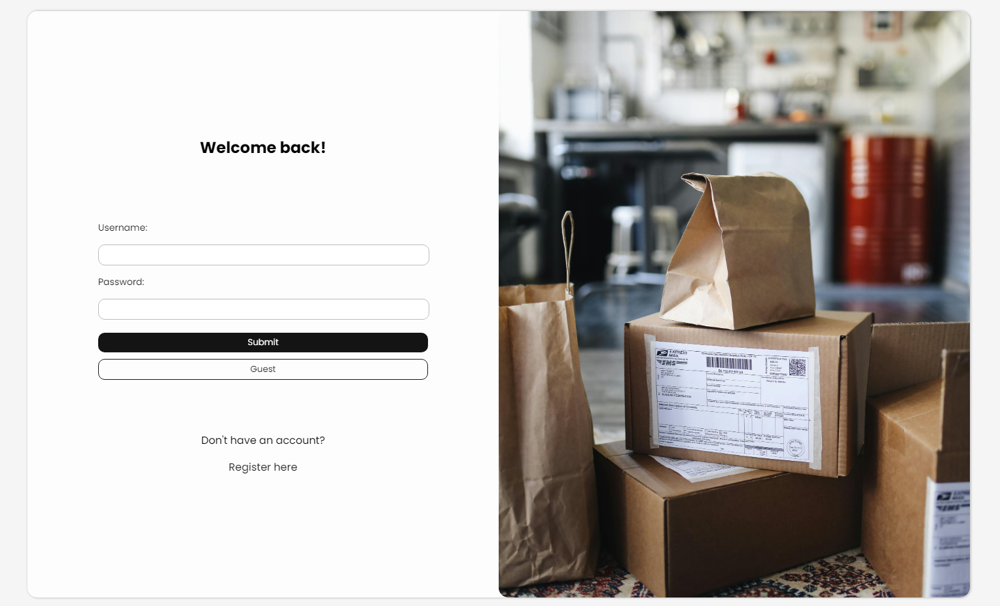
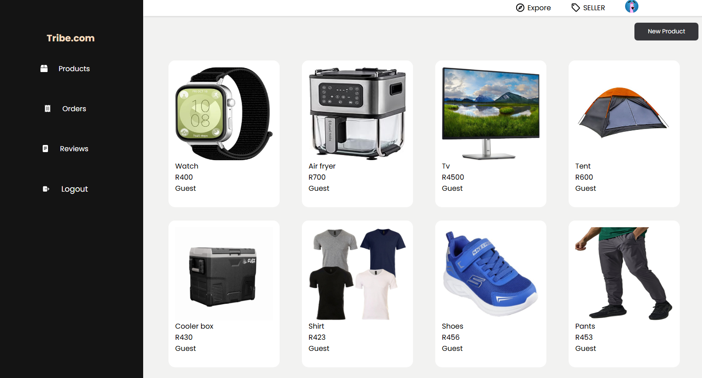

# MERN Marketplace App | FRONTEND

React Marketplace App using MongoDb as database. A simple marketplace app that functions similar to Facebook marketplace, where users can add their own products and sell them to other users. Or they can simply buy products from other users.

### Marketplace App | Backend

[https://github.com/Lspacedev/marketplace-app-backend](https://github.com/Lspacedev/marketplace-app-backend)

## Installation

1. Clone the repository

```bash
git@github.com:Lspacedev/marketplace-app-frontend.git
```

2. Navigate to the project folder

```bash
cd marketplace-app-frontend
```

3.  Install All Dependencies

```bash
npm install
```

4. Create an env file and add STRIPE_PUBLISHABLE_KEY, STRIPE_PRICE_ID,VITE_PROD_URL, VITE_CLIENT_URL.

5. Run the project

```bash
npm run dev
```

## Screenshot





## Features

Users

- Authentication: Create a user account.
- Authentication: Login to your account.

Role - BUYER

- Track your orders.
- Add and view product reviews.
- Update account information.
- Become a seller (optional).

Role - SELLER

- Add products.
- Update products.
- Remove products.

- Track your orders.
- Add and view product reviews.
- Update account information.

Products

- Users can view all products in the marketplace.
- Users can view individual product.
- Users can add product to cart.
- Users can buy product.

Payment

- Users can pay for their products, using Stripe Payment.

## Usage

1. Open the live site in your browser.
2. Login or create an account.
3. View products in the marketplace.

## Stipe Test Cards:

```python
https://docs.stripe.com/testing
```

## Tech Stack

- ReactJs
- NodeJs
- ExpressJs
- MongoDb
- Cloudinary

## Credits:

```python
Photo by Andrea Piacquadio: https://www.pexels.com/photo/assorted-gift-boxes-on-brown-wooden-floor-surface-1050244/

Photo by Polina Tankilevitch: https://www.pexels.com/photo/boxes-and-paper-bags-on-the-floor-4440839/

```
